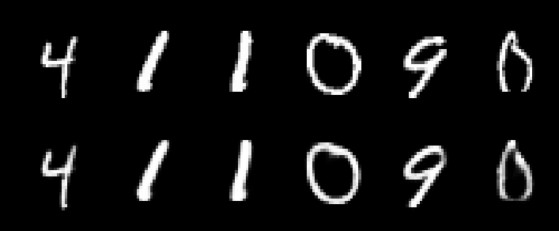
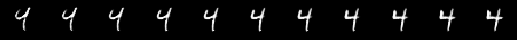
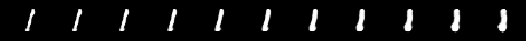
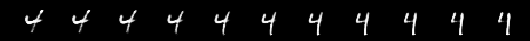

Capsule Networks
==========================

Implemented using TensorFlow 
Based on the paper "Dynamic Routing Between Capsules"

# Requirements
* python3
* TensorFlow
* NumPy
* Matplotlib

# Dataset
* MNIST datasets
You can download at [download link](http://yann.lecun.com/exdb/mnist/)
and locate them in the './MNIST_data' directory.

# How to run Training & Testing
Locate the MNIST datasets in the './MNIST_data' directory and just run capsNet.ipynb

# Results
## Accuracy
* The best error

|         %  | Training | Validation |   Test  |
| ---------- | -------- | ---------- | ------- |
|Implemented |  0.0273  |    0.641   |  0.6611 |
|Paper       |     -    |      -     |   0.25  |

The performance measurement was done with a CapsNet with 3 routing iterations and reconstruction.

## Sample MNIST Test Reconstruction

* Sample MNIST test reconstructions of a CapsNet with 3 routing iterations.
* The images on the first row are the input images, and that on the second row are the reconstructions.
* We can see that the reconstructions preserves many of the details of the input while smoothing the noise.

## What the individual dimensions of a capsule represent
* We can see what the individual dimensions represent by feeding a perturbed version of the activity vector to the decoder network and see how the perturbation affects the reconstruction.
* By the experiment, the representations of each dimension can be translated as follows.
* The dimension of the DigitCaps representation is tweaked by intervals of 0.05 in the range [−0.25, 0.25].
+ Localized skew

+ Scale of thickness

+ Width

